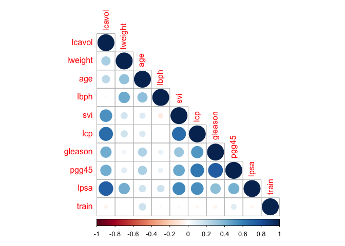
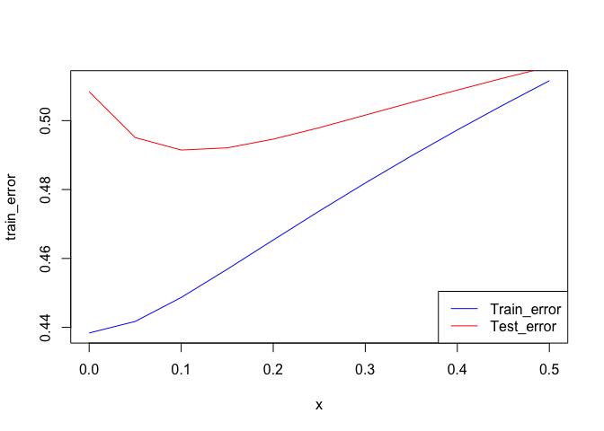
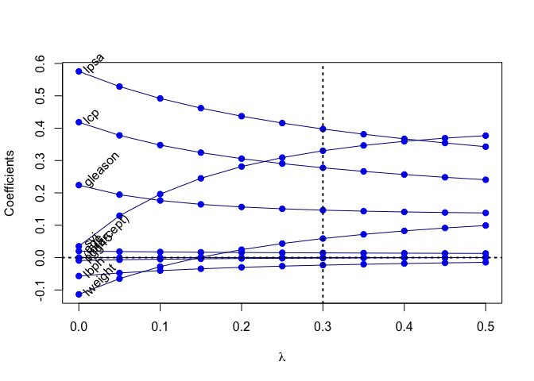

Week_3
================
Yue Guo

``` r
library(corrplot)
```

    ## corrplot 0.90 loaded

``` r
library(tidyverse)
```

    ## ── Attaching packages ─────────────────────────────────────── tidyverse 1.3.1 ──

    ## ✓ ggplot2 3.3.5     ✓ purrr   0.3.4
    ## ✓ tibble  3.1.6     ✓ dplyr   1.0.7
    ## ✓ tidyr   1.1.4     ✓ stringr 1.4.0
    ## ✓ readr   2.0.2     ✓ forcats 0.5.1

    ## ── Conflicts ────────────────────────────────────────── tidyverse_conflicts() ──
    ## x dplyr::filter() masks stats::filter()
    ## x dplyr::lag()    masks stats::lag()

``` r
library(glmnet)
```

    ## Loading required package: Matrix

    ## 
    ## Attaching package: 'Matrix'

    ## The following objects are masked from 'package:tidyr':
    ## 
    ##     expand, pack, unpack

    ## Loaded glmnet 4.1-3

# Question 1

Use the prostate cancer data. Use the cor function to reproduce the
correlations listed in HTF Table 3.1, page 50.

``` r
prostate <- 
  read.table(url(
    'https://web.stanford.edu/~hastie/ElemStatLearn/datasets/prostate.data'))
cor_relation <- cor(prostate)
cor_relation
```

    ##              lcavol      lweight       age         lbph         svi
    ## lcavol   1.00000000  0.280521380 0.2249999  0.027349703  0.53884500
    ## lweight  0.28052138  1.000000000 0.3479691  0.442264399  0.15538490
    ## age      0.22499988  0.347969112 1.0000000  0.350185896  0.11765804
    ## lbph     0.02734970  0.442264399 0.3501859  1.000000000 -0.08584324
    ## svi      0.53884500  0.155384903 0.1176580 -0.085843238  1.00000000
    ## lcp      0.67531048  0.164537142 0.1276678 -0.006999431  0.67311118
    ## gleason  0.43241706  0.056882093 0.2688916  0.077820447  0.32041222
    ## pgg45    0.43365225  0.107353785 0.2761124  0.078460018  0.45764762
    ## lpsa     0.73446033  0.433319382 0.1695928  0.179809404  0.56621822
    ## train   -0.04654347 -0.009940658 0.1776155 -0.029939957  0.02679950
    ##                  lcp     gleason      pgg45        lpsa        train
    ## lcavol   0.675310484  0.43241706 0.43365225  0.73446033 -0.046543468
    ## lweight  0.164537142  0.05688209 0.10735379  0.43331938 -0.009940658
    ## age      0.127667752  0.26889160 0.27611245  0.16959284  0.177615517
    ## lbph    -0.006999431  0.07782045 0.07846002  0.17980940 -0.029939957
    ## svi      0.673111185  0.32041222 0.45764762  0.56621822  0.026799505
    ## lcp      1.000000000  0.51483006 0.63152825  0.54881317 -0.037427296
    ## gleason  0.514830063  1.00000000 0.75190451  0.36898681 -0.044171456
    ## pgg45    0.631528246  0.75190451 1.00000000  0.42231586  0.100516371
    ## lpsa     0.548813175  0.36898681 0.42231586  1.00000000 -0.033889743
    ## train   -0.037427296 -0.04417146 0.10051637 -0.03388974  1.000000000

``` r
corrplot(cor_relation, method = c("circle"),type = c("lower"))
```

<!-- --> # Question 2
Treat lcavol as the outcome, and use all other variables in the data set
as predictors. With the training subset of the prostate data, train a
least-squares regression model with all predictors using the lm
function.

``` r
train <- prostate %>%
  filter(train ==TRUE)%>%
  select(-train)

fit_linear <- lm(lcavol ~ ., data = train)
```

# Question 3

Use the testing subset to compute the test error (average squared-error
loss) using the fitted least-squares regression model.

``` r
test <- prostate %>%
  filter(train == FALSE)%>%
  select(-train)

linear_pred <- predict(fit_linear,test)

linear_test_err <- mean((linear_pred-test$lcavol)^2)
linear_test_err 
```

    ## [1] 0.5084068

# Question 4

Train a ridge regression model using the glmnet function, and tune the
value of lambda (i.e., use guess and check to find the value of lambda
that approximately minimizes the test error).

``` r
x_input <- model.matrix(lcavol ~ ., data = train)
y_out <- train$lcavol
ridge_fit <-glmnet(x_input,y_out,alpha = 0, lambda = seq(0.5,0,-0.05))
error <- function(x,y){
  mean((y-x)^2)
}
error(y_out, predict(ridge_fit, newx = x_input, s =0.3))
```

    ## [1] 0.4818996

``` r
error(y_out, predict(ridge_fit, newx = x_input, s =0.2))
```

    ## [1] 0.4653592

``` r
error(y_out, predict(ridge_fit, newx = x_input, s =0.1))
```

    ## [1] 0.4486784

``` r
error(y_out, predict(ridge_fit, newx = x_input, s =0))
```

    ## [1] 0.4383709

From the result we can see that when lambda equals to around 0.1, model
approximately has the smallest test error. # Question 5 Create a figure
that shows the training and test error associated with ridge regression
as a function of lambda

``` r
ridge_error_plot <- function(dataset, lambda,train_set = train){
  error <- rep(0,1)
  s = 1
  x_input <- model.matrix(lcavol~., data = train)
  y_out <- train$lcavol
  x_in <- model.matrix(lcavol~., data = dataset)
  for(i in lambda){
    ridge_fit_new <- glmnet(x_input,y_out,alpha = 0, lambda = i)
    ridge_pred <- predict(ridge_fit_new, newx = x_in, s =i)
    error[s] <- mean((ridge_pred-dataset$lcavol)^2)
    s = s+1
  }
  return(error)
}

test_error <- ridge_error_plot(test,lambda = seq(0.5,0,-0.05))
train_error <- ridge_error_plot(train,lambda = seq(0.5,0,-0.05))
x <- ridge_fit$lambda
plot(x,train_error,col = "blue",type = "l")
lines(x,test_error,type = "l",col = "red")
legend("bottomright",legend = c("Train_error", "Test_error"),col = c("blue","red"),lty = 1, lwd = 1)
```

<!-- -->

# Question 6

Create a path diagram of the ridge regression analysis, similar to HTF
Figure 3.8

``` r
plot(x=range(ridge_fit$lambda),
     y=range(as.matrix(ridge_fit$beta)),
     type='n',
     xlab=expression(lambda),
     ylab='Coefficients')
for(i in 1:nrow(ridge_fit$beta)) {
  points(x=ridge_fit$lambda, y=ridge_fit$beta[i,], pch=19, col='blue')
  lines(x=ridge_fit$lambda, y=ridge_fit$beta[i,], col='darkblue')
}
text(x=0, y=ridge_fit$beta[,ncol(ridge_fit$beta)], 
     labels=rownames(ridge_fit$beta),
     xpd=NA, pos=4, srt=45)
abline(v=0.3, lty=3, lwd=2)
abline(h=0, lty=3, lwd=2)
```

<!-- -->
