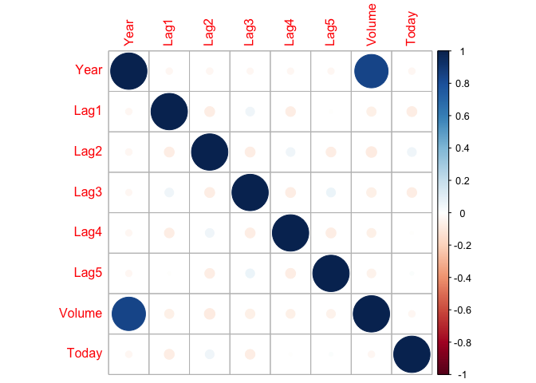

Homework 4
================
Yue Guo
February 15, 2022

# Question 1

## a

1/10

## b

1/100

## c

0.1^100

## d

From the answer of a to c, we can find that when the number of the
features is increasing, the number of pbservations we can use to predict
is decreasing, whcih will makes the prediction result worse. When the
number of features is large enough, there will be no obersvations close
to the given test and aslo no predictions.

## e

p =1

``` r
x = 0.1
x
```

    ## [1] 0.1

p = 2

``` r
x = 0.1^(1/2)
x
```

    ## [1] 0.3162278

x = sqrt(0.1)

p = 100

``` r
x = 0.1^(1/100)
x
```

    ## [1] 0.9772372

# Question 2

## a

``` r
library(ISLR2)
library(corrplot)
```

    ## corrplot 0.90 loaded

``` r
library(tidyverse)
```

    ## ── Attaching packages ─────────────────────────────────────── tidyverse 1.3.1 ──

    ## ✓ ggplot2 3.3.5     ✓ purrr   0.3.4
    ## ✓ tibble  3.1.6     ✓ dplyr   1.0.7
    ## ✓ tidyr   1.1.4     ✓ stringr 1.4.0
    ## ✓ readr   2.0.2     ✓ forcats 0.5.1

    ## ── Conflicts ────────────────────────────────────────── tidyverse_conflicts() ──
    ## x dplyr::filter() masks stats::filter()
    ## x dplyr::lag()    masks stats::lag()

``` r
library(MASS)
```

    ## 
    ## Attaching package: 'MASS'

    ## The following object is masked from 'package:dplyr':
    ## 
    ##     select

    ## The following object is masked from 'package:ISLR2':
    ## 
    ##     Boston

``` r
library(class)
library(e1071)
```

``` r
summary(Weekly)
```

    ##       Year           Lag1               Lag2               Lag3         
    ##  Min.   :1990   Min.   :-18.1950   Min.   :-18.1950   Min.   :-18.1950  
    ##  1st Qu.:1995   1st Qu.: -1.1540   1st Qu.: -1.1540   1st Qu.: -1.1580  
    ##  Median :2000   Median :  0.2410   Median :  0.2410   Median :  0.2410  
    ##  Mean   :2000   Mean   :  0.1506   Mean   :  0.1511   Mean   :  0.1472  
    ##  3rd Qu.:2005   3rd Qu.:  1.4050   3rd Qu.:  1.4090   3rd Qu.:  1.4090  
    ##  Max.   :2010   Max.   : 12.0260   Max.   : 12.0260   Max.   : 12.0260  
    ##       Lag4               Lag5              Volume            Today         
    ##  Min.   :-18.1950   Min.   :-18.1950   Min.   :0.08747   Min.   :-18.1950  
    ##  1st Qu.: -1.1580   1st Qu.: -1.1660   1st Qu.:0.33202   1st Qu.: -1.1540  
    ##  Median :  0.2380   Median :  0.2340   Median :1.00268   Median :  0.2410  
    ##  Mean   :  0.1458   Mean   :  0.1399   Mean   :1.57462   Mean   :  0.1499  
    ##  3rd Qu.:  1.4090   3rd Qu.:  1.4050   3rd Qu.:2.05373   3rd Qu.:  1.4050  
    ##  Max.   : 12.0260   Max.   : 12.0260   Max.   :9.32821   Max.   : 12.0260  
    ##  Direction 
    ##  Down:484  
    ##  Up  :605  
    ##            
    ##            
    ##            
    ## 

``` r
attach(Weekly)
cordata <- cor(Weekly[,-9])
corrplot(cordata)
```

<!-- -->

## b

``` r
l_model <- glm(Direction ~ Lag1+Lag2+Lag3+Lag4+Lag5+Volume,data = Weekly,family=binomial)

summary(l_model)
```

    ## 
    ## Call:
    ## glm(formula = Direction ~ Lag1 + Lag2 + Lag3 + Lag4 + Lag5 + 
    ##     Volume, family = binomial, data = Weekly)
    ## 
    ## Deviance Residuals: 
    ##     Min       1Q   Median       3Q      Max  
    ## -1.6949  -1.2565   0.9913   1.0849   1.4579  
    ## 
    ## Coefficients:
    ##             Estimate Std. Error z value Pr(>|z|)   
    ## (Intercept)  0.26686    0.08593   3.106   0.0019 **
    ## Lag1        -0.04127    0.02641  -1.563   0.1181   
    ## Lag2         0.05844    0.02686   2.175   0.0296 * 
    ## Lag3        -0.01606    0.02666  -0.602   0.5469   
    ## Lag4        -0.02779    0.02646  -1.050   0.2937   
    ## Lag5        -0.01447    0.02638  -0.549   0.5833   
    ## Volume      -0.02274    0.03690  -0.616   0.5377   
    ## ---
    ## Signif. codes:  0 '***' 0.001 '**' 0.01 '*' 0.05 '.' 0.1 ' ' 1
    ## 
    ## (Dispersion parameter for binomial family taken to be 1)
    ## 
    ##     Null deviance: 1496.2  on 1088  degrees of freedom
    ## Residual deviance: 1486.4  on 1082  degrees of freedom
    ## AIC: 1500.4
    ## 
    ## Number of Fisher Scoring iterations: 4

from the result we cna see that Lag2 id statistically significant. ## c

``` r
result <- function(fun,data){
  prob <- predict(fun,data)
  result_prediction = rep("Down", length(prob))
  result_prediction[prob > 0.5] <- "Up"
  tab <- table(data$Direction,result_prediction)
  return(tab)
}
fraction <- function(table){
  acc <- (table[1] + table[4])/(table[2] + table[3]+table[1] + table[4])
  return(acc)
}
table <- result(l_model,Weekly)
table
```

    ##       result_prediction
    ##        Down  Up
    ##   Down  465  19
    ##   Up    563  42

``` r
fraction(table)
```

    ## [1] 0.4655647

There are two kind of mistakes: 1. Predict Down which in fact is up:

``` r
 563/(563+42)
```

    ## [1] 0.9305785

2.  Predict Up which in fact is Down:

``` r
19/(465+19)
```

    ## [1] 0.0392562

## d

``` r
train_data <- Weekly%>%
  filter(Year >= 1990 & Year < 2008)

test_data <-Weekly%>%
  filter(Year >= 2009 & Year < 2010)

l_model_new <- glm(Direction ~ Lag2,data = train_data,family=binomial)


result_glm <- result(l_model_new, test_data)
result_glm
```

    ##       result_prediction
    ##        Down Up
    ##   Down   22  1
    ##   Up     25  4

``` r
fraction(result_glm)
```

    ## [1] 0.5

Overall fraction is 0.4230769

## e

``` r
model_LDA <- lda(Direction~Lag2, data=train_data,family=binomial)
LDA <- predict(model_LDA,test_data)$class
result_LDA <- table(test_data$Direction,LDA)
result_LDA
```

    ##       LDA
    ##        Down Up
    ##   Down    1 22
    ##   Up      2 27

``` r
fraction(result_LDA)
```

    ## [1] 0.5384615

Overall fraction is 0.5384615 ## f

``` r
model_QDA <- qda(Direction~Lag2, data=train_data,family=binomial)
QDA <- predict(model_QDA,test_data)$class
result_QDA <- table(test_data$Direction,QDA)
result_QDA
```

    ##       QDA
    ##        Down Up
    ##   Down    0 23
    ##   Up      0 29

``` r
fraction(result_QDA)
```

    ## [1] 0.5576923

Overall fraction is 0.5576923 ## g

``` r
Week.train <- as.matrix(train_data["Lag2"])
Week.test <- as.matrix(test_data["Lag2"])
train.Direction <- as.matrix(train_data["Direction"])
set.seed(1)
Weekknn.pred <- knn(Week.train,Week.test,train.Direction,k=1)
Weekknn_table <- table(Weekknn.pred,as.matrix(test_data["Direction"]))
Weekknn_table
```

    ##             
    ## Weekknn.pred Down Up
    ##         Down   13 14
    ##         Up     10 15

``` r
fraction(Weekknn_table)
```

    ## [1] 0.5384615

Overall fraction is 0.5384615 ## h

``` r
model_nb <- naiveBayes(Week.train,train.Direction)
Weekknn_pred_nb <- predict(model_nb,Week.test)
Weekknn_table_nb <- table(Weekknn_pred_nb,as.matrix(test_data["Direction"]))

Weekknn_table_nb
```

    ##                
    ## Weekknn_pred_nb Down Up
    ##            Down    0  0
    ##            Up     23 29

``` r
fraction(Weekknn_table_nb)
```

    ## [1] 0.5576923

Overall fraction is 0.5576923 ## i From the result we can see that QDA
and naive bayes has the best result.

## j

I will use Lag2 +Volume and K =2,3,4 experiment.

### logistic regression

``` r
lg_model <- glm(Direction ~ Lag2 + Volume +Lag1, data = train_data,family=binomial)
table1 <- result(lg_model,test_data)
fraction(table1)
```

    ## [1] 0.4230769

Lower than only use Lag2

### LDA

``` r
lda_model <- lda(Direction ~ Lag2 + Volume +Lag1, data = train_data,family=binomial)
lda_pred <- predict(lda_model,test_data)$class
table2 <- table(lda_pred,test_data$Direction)
fraction(table2)
```

    ## [1] 0.4615385

Lower than only use Lag2

### KNN

``` r
Week.train <- as.matrix(train_data["Lag2"] + train_data["Volume"])
Week.test <- as.matrix(test_data["Lag2"] + test_data["Volume"])
train.Direction <- as.matrix(train_data["Direction"])
set.seed(1)
Weekknn.pred <- knn(Week.train,Week.test,train.Direction,k=4)
Weekknn_table <- table(Weekknn.pred,as.matrix(test_data["Direction"]))
Weekknn_table
```

    ##             
    ## Weekknn.pred Down Up
    ##         Down    5  5
    ##         Up     18 24

``` r
fraction(Weekknn_table)
```

    ## [1] 0.5576923

``` r
Week.train <- as.matrix(train_data["Lag2"] + train_data["Volume"])
Week.test <- as.matrix(test_data["Lag2"] + test_data["Volume"])
train.Direction <- as.matrix(train_data["Direction"])
set.seed(1)
Weekknn.pred <- knn(Week.train,Week.test,train.Direction,k=3)
Weekknn_table <- table(Weekknn.pred,as.matrix(test_data["Direction"]))
Weekknn_table
```

    ##             
    ## Weekknn.pred Down Up
    ##         Down    5  5
    ##         Up     18 24

``` r
fraction(Weekknn_table)
```

    ## [1] 0.5576923

``` r
Week.train <- as.matrix(train_data["Lag2"] + train_data["Volume"])
Week.test <- as.matrix(test_data["Lag2"] + test_data["Volume"])
train.Direction <- as.matrix(train_data["Direction"])
set.seed(1)
Weekknn.pred <- knn(Week.train,Week.test,train.Direction,k=2)
Weekknn_table <- table(Weekknn.pred,as.matrix(test_data["Direction"]))
Weekknn_table
```

    ##             
    ## Weekknn.pred Down Up
    ##         Down    4  7
    ##         Up     19 22

``` r
fraction(Weekknn_table)
```

    ## [1] 0.5

From the result we can see that the when K=3 and 4 the score is the
best.

### NaiveBayes

``` r
model_nb <- naiveBayes(Week.train,train.Direction)
Weekknn_pred_nb <- predict(model_nb,Week.test)
Weekknn_table_nb <- table(Weekknn_pred_nb,as.matrix(test_data["Direction"]))

Weekknn_table_nb
```

    ##                
    ## Weekknn_pred_nb Down Up
    ##            Down    0  0
    ##            Up     23 29

``` r
fraction(Weekknn_table_nb)
```

    ## [1] 0.5576923

Same with only using Lag2
