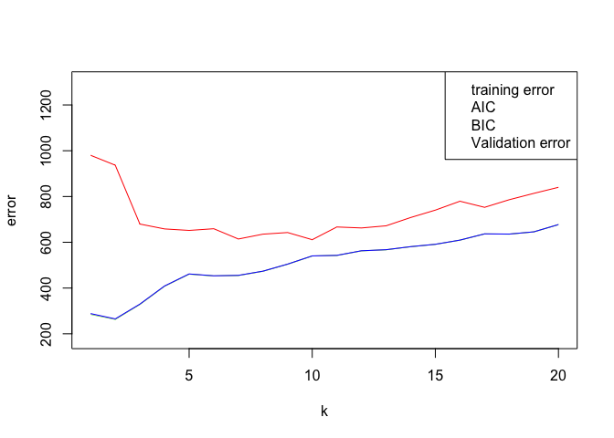
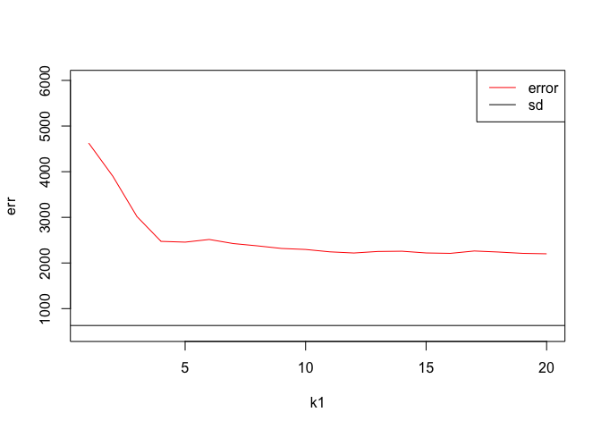

Homework 5
================
DS Student
January 15, 2020

## Randomly split the mcycle data into training (75%) and validation (25%) subsets.

``` r
library('MASS')
data <- mcycle
dim(data)[1]
```

    ## [1] 133

``` r
train_data_ind <- sample(dim(data)[1], dim(data)[1]*0.75) 
train_data <- data[train_data_ind,]
test_data <- data[-train_data_ind,]
train_y <- train_data$accel
train_x <- matrix(train_data$times, length(train_data$times), 1)
test_y <- test_data$accel
test_x <- matrix(test_data$times, length(test_data$times), 1)
```

## Using the mcycle data, consider predicting the mean acceleration as a function of time. Use the Nadaraya-Watson method with the k-NN kernel function to create a series of prediction models by varying the tuning parameter over a sequence of values. (hint: the script already implements this)

``` r
Nadaraya_Watson <- function(y,x,x0,kern,...){
  a <- t(apply(x0, 1, function(x0_){
    k <- kern(x,x0_,...)
    k/sum(k)
    }))

    y_hat <- drop(a %*% y)
    attr(y_hat,"k") <- a
    return(y_hat)
}

kernel_k_nearest_neighbors <- function(x, x0, t=1) {
  ## compute distance betwen each x and x0
  z <- t(t(x) - x0)
  d <- sqrt(rowSums(z*z))

  ## initialize kernel weights to zero
  w <- rep(0, length(d))
  
  ## set weight to 1 for k nearest neighbors
  w[order(d)[1:t]] <- 1
  
  return(w)
}
k1 <- seq(1,20,1)
for (i in k1){
  y_hat <- Nadaraya_Watson(y = train_y,x = train_x,x0 = test_x, kern = kernel_k_nearest_neighbors, t = i)
}
```

## With the squared-error loss function, compute and plot the training error, AIC, BIC, and validation error (using the validation data) as functions of the tuning parameter.

``` r
effective_df <- function(y, x, kern, ...) {
  y_hat <- Nadaraya_Watson(y, x, x,
    kern=kern, ...)
  sum(diag(attr(y_hat, 'k')))
}


loss_squared_error <- function(y, yhat)
  (y - yhat)^2

error <- function(y, yhat, loss=loss_squared_error)
  mean(loss(y, yhat))

aic <- function(y, yhat, d)
  error(y, yhat) + 2/length(y)*d

bic <- function(y, yhat, d)
  error(y, yhat) + log(length(y))/length(y)*d

AIC <- rep(0,1)
BIC <- rep(0,1)
training_error <- rep(0,1)
testing_error <- rep(0,1)
s = 1

for (i in (1:length(k1))){
  edf <- effective_df(train_y, train_x, kernel_k_nearest_neighbors, t=k1[i])
  y_hat_train <- Nadaraya_Watson(y = train_y,x = train_x,x0 = train_x, kern = kernel_k_nearest_neighbors, t = k1[i])
  y_hat_test <- Nadaraya_Watson(y = train_y,x = train_x,x0 = test_x, kern = kernel_k_nearest_neighbors, t = k1[i])
  AIC[i] <- aic(train_y, y_hat_train,edf)
  BIC[i] <- bic(train_y, y_hat_train,edf)
  training_error[i] <- error(train_y, y_hat_train)
  testing_error[i] <- error(test_y, y_hat_test)
}
print(training_error)
```

    ##  [1] 284.9848 263.0338 328.3265 407.7039 460.7364 452.7601 454.8026 473.3135
    ##  [9] 504.1084 540.0209 542.4097 562.5842 567.2345 580.6049 590.9725 609.2763
    ## [17] 636.4693 635.5864 645.4285 677.1933

``` r
print(testing_error)
```

    ##  [1] 980.0682 936.8195 679.6771 658.3990 651.8185 659.2546 614.3247 635.4877
    ##  [9] 642.6018 611.3120 666.8696 662.6055 671.9760 708.2737 740.5308 779.3943
    ## [17] 752.7568 785.9547 813.7465 840.1963

``` r
print(AIC)
```

    ##  [1] 286.4798 263.9934 328.9864 408.2039 461.1364 453.0934 455.0883 473.5635
    ##  [9] 504.3306 540.2209 542.5915 562.7509 567.3884 580.7477 591.1059 609.4013
    ## [17] 636.5870 635.6975 645.5338 677.2933

``` r
print(BIC)
```

    ##  [1] 288.4196 265.2385 329.8427 408.8527 461.6554 453.5260 455.4591 473.8879
    ##  [9] 504.6190 540.4804 542.8274 562.9672 567.5880 580.9331 591.2789 609.5635
    ## [17] 636.7396 635.8417 645.6703 677.4231

``` r
plot(k1,training_error,type = "l", col = "green",ylim = c(180,1300),xlab = "k",ylab = "error")
lines(k1,AIC,col = "pink",type = "l")
lines(k1,BIC,col = "blue",type = "l")
lines(k1,testing_error,col = "red",type = "l")
legend("topright", c("training error", "AIC", "BIC", "Validation error"), col = c("green","pink","blue","red"))
```

<!-- -->

## For each value of the tuning parameter, Perform 5-fold cross-validation using the combined training and validation data. This results in 5 estimates of test error per tuning parameter value.

``` r
f <- 5
k1 <- seq(1,20,1)
folds <- sample(rep(1:5,length(data)))
err <- rep(0,1)
for (i in (1:length(k1))){
  e <- rep(0,5)
  for (j in (1:5)){
    train_y <- train_data$accel[folds!= j]
    train_x <- matrix(data$times[folds!= j], length(train_data$times[folds!= j]), 1)
    test_y <- test_data$accel
    test_x <- matrix(test_data$times[folds== j], length(test_data$times[folds== j]), 1)
    # train model
    y_hat <- Nadaraya_Watson(y = train_y,x = train_x,x0 = test_x, kern = kernel_k_nearest_neighbors, t = k1[i])
    # error of every validation
    
    e[j] <- error(test_y, y_hat)
  }
  print(e)
  err[i] <- mean(e)
}
```

    ## [1] 3293.821 4856.316 4514.943 2649.061 7818.024
    ## [1] 3896.166 3404.711 5461.150 3446.134 3295.178
    ## [1] 3253.442 2698.685 3425.531 3223.373 2490.486
    ## [1] 2758.393 2280.772 2346.958 2839.267 2142.472
    ## [1] 2638.699 2337.994 2246.726 2835.450 2222.578
    ## [1] 2595.761 2425.800 2413.419 2837.136 2303.783
    ## [1] 2331.797 2381.169 2307.547 2623.992 2481.918
    ## [1] 2325.227 2264.255 2280.279 2649.863 2355.736
    ## [1] 2184.095 2206.215 2221.990 2576.359 2402.242
    ## [1] 2231.040 2141.532 2255.673 2530.186 2321.172
    ## [1] 2208.323 2056.585 2189.733 2450.195 2316.247
    ## [1] 2160.962 2044.187 2229.797 2400.546 2257.476
    ## [1] 2104.024 2082.359 2249.407 2495.101 2330.798
    ## [1] 2108.896 2105.436 2189.031 2567.207 2317.223
    ## [1] 2101.804 2138.308 2151.207 2455.155 2251.312
    ## [1] 2145.505 2136.930 2102.573 2463.261 2205.120
    ## [1] 2210.271 2108.656 2228.465 2508.007 2257.325
    ## [1] 2208.679 2102.508 2155.781 2415.557 2317.160
    ## [1] 2199.538 2106.128 2119.798 2374.604 2253.736
    ## [1] 2180.758 2099.015 2120.201 2340.009 2265.388

## Plot the CV-estimated test error (average of the five estimates from each fold) as a function of the tuning parameter. Add vertical line segments to the figure (using the segments function in R) that represent one “standard error” of the CV-estimated test error (standard deviation of the five estimates from each fold).

``` r
sd <- sd(err)
plot(k1,err,type = "l",col = "red", ylim = c(500,6000))
abline(h = sd)
legend("topright",c("error", "sd"), col = c("red", "black"),lty = 1 )
```

<!-- -->

## Interpret the resulting figures and select a suitable value for the tuning parameter.

From the plot we can see that when k = 10, the test and train plot is
the smallest. When k \>10 and k increases, test and train error also
increase. Waht’s more, AIC, BIC are similar with the train error.
Therefore, suitable k value is about 10.
