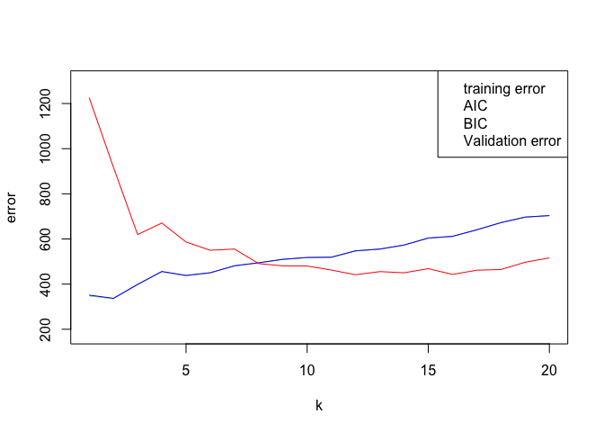
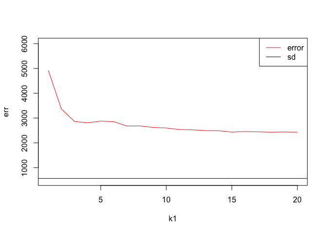

Homework 5
================
DS Student
January 15, 2020

## Randomly split the mcycle data into training (75%) and validation (25%) subsets.

``` r
set.seed(10)
library('MASS')
data <- mcycle
train_data_ind <- sample(dim(data)[1], dim(data)[1]*0.75) 
train_data <- data[train_data_ind,]
test_data <- data[-train_data_ind,]
train_y <- train_data$accel
train_x <- matrix(train_data$times, length(train_data$times), 1)
test_y <- test_data$accel
test_x <- matrix(test_data$times, length(test_data$times), 1)
```

## Using the mcycle data, consider predicting the mean acceleration as a function of time. Use the Nadaraya-Watson method with the k-NN kernel function to create a series of prediction models by varying the tuning parameter over a sequence of values. (hint: the script already implements this)

``` r
Nadaraya_Watson <- function(y,x,x0,kern,...){
  a <- t(apply(x0, 1, function(x0_){
    k <- kern(x,x0_,...)
    k/sum(k)
    }))

    y_hat <- drop(a %*% y)
    attr(y_hat,"k") <- a
    return(y_hat)
}

kernel_k_nearest_neighbors <- function(x, x0, t=1) {
  ## compute distance betwen each x and x0
  z <- t(t(x) - x0)
  d <- sqrt(rowSums(z*z))

  ## initialize kernel weights to zero
  w <- rep(0, length(d))
  
  ## set weight to 1 for k nearest neighbors
  w[order(d)[1:t]] <- 1
  
  return(w)
}
k1 <- seq(1,20,1)
for (i in k1){
  y_hat <- Nadaraya_Watson(y = train_y,x = train_x,x0 = test_x, kern = kernel_k_nearest_neighbors, t = i)
}
```

## With the squared-error loss function, compute and plot the training error, AIC, BIC, and validation error (using the validation data) as functions of the tuning parameter.

``` r
effective_df <- function(y, x, kern, ...) {
  y_hat <- Nadaraya_Watson(y, x, x,
    kern=kern, ...)
  sum(diag(attr(y_hat, 'k')))
}


loss_squared_error <- function(y, yhat)
  (y - yhat)^2

error <- function(y, yhat, loss=loss_squared_error)
  mean(loss(y, yhat))

aic <- function(y, yhat, d)
  error(y, yhat) + 2/length(y)*d

bic <- function(y, yhat, d)
  error(y, yhat) + log(length(y))/length(y)*d

AIC <- rep(0,1)
BIC <- rep(0,1)
training_error <- rep(0,1)
testing_error <- rep(0,1)
s = 1

for (i in (1:length(k1))){
  edf <- effective_df(train_y, train_x, kernel_k_nearest_neighbors, t=k1[i])
  y_hat_train <- Nadaraya_Watson(y = train_y,x = train_x,x0 = train_x, kern = kernel_k_nearest_neighbors, t = k1[i])
  y_hat_test <- Nadaraya_Watson(y = train_y,x = train_x,x0 = test_x, kern = kernel_k_nearest_neighbors, t = k1[i])
  AIC[i] <- aic(train_y, y_hat_train,edf)
  BIC[i] <- bic(train_y, y_hat_train,edf)
  training_error[i] <- error(train_y, y_hat_train)
  testing_error[i] <- error(test_y, y_hat_test)
}
print(training_error)
```

    ##  [1] 347.8118 335.0046 397.3282 454.7671 437.4206 449.7097 480.5426 494.0109
    ##  [9] 509.4259 517.5369 518.7930 547.1532 554.8481 572.8065 603.6862 611.3022
    ## [17] 640.1867 672.1709 696.6034 703.3017

``` r
print(testing_error)
```

    ##  [1] 1226.2150  918.2713  619.4665  670.6629  586.5870  549.9499  555.3974
    ##  [8]  490.8282  480.6784  480.2959  462.2808  441.3412  455.4239  450.1731
    ## [15]  468.3974  442.9307  461.5240  464.6971  496.8947  515.9754

``` r
print(AIC)
```

    ##  [1] 349.3068 335.9238 397.9680 455.2570 437.8166 450.0430 480.8283 494.2609
    ##  [9] 509.6482 517.7369 518.9748 547.3198 555.0020 572.9493 603.8195 611.4272
    ## [17] 640.3044 672.2820 696.7086 703.4017

``` r
print(BIC)
```

    ##  [1] 351.2466 337.1165 398.7980 455.8927 438.3304 450.4755 481.1990 494.5853
    ##  [9] 509.9365 517.9964 519.2107 547.5361 555.2016 573.1347 603.9925 611.5894
    ## [17] 640.4570 672.4262 696.8452 703.5314

``` r
plot(k1,training_error,type = "l", col = "green",ylim = c(180,1300),xlab = "k",ylab = "error")
lines(k1,AIC,col = "pink",type = "l")
lines(k1,BIC,col = "blue",type = "l")
lines(k1,testing_error,col = "red",type = "l")
legend("topright", c("training error", "AIC", "BIC", "Validation error"), col = c("green","pink","blue","red"))
```

<!-- -->

## For each value of the tuning parameter, Perform 5-fold cross-validation using the combined training and validation data. This results in 5 estimates of test error per tuning parameter value.

``` r
f <- 5
k1 <- seq(1,20,1)
folds <- sample(rep(1:5,length(data)))
err <- rep(0,1)
for (i in (1:length(k1))){
  e <- rep(0,5)
  for (j in (1:5)){
    train_y <- train_data$accel[folds!= j]
    train_x <- matrix(data$times[folds!= j], length(train_data$times[folds!= j]), 1)
    test_y <- test_data$accel
    test_x <- matrix(test_data$times[folds== j], length(test_data$times[folds== j]), 1)
    # train model
    y_hat <- Nadaraya_Watson(y = train_y,x = train_x,x0 = test_x, kern = kernel_k_nearest_neighbors, t = k1[i])
    # error of every validation
    
    e[j] <- error(test_y, y_hat)
  }
  print(e)
  err[i] <- mean(e)
}
```

    ## [1] 3739.224 3579.046 5952.856 4173.572 7187.063
    ## [1] 3709.170 3699.409 3010.397 3360.645 3046.506
    ## [1] 2924.981 3331.008 2628.170 2833.894 2605.769
    ## [1] 3074.707 3261.560 2550.941 2482.107 2664.946
    ## [1] 3009.671 3466.754 2596.544 2610.266 2702.501
    ## [1] 2886.994 3442.137 2591.252 2475.228 2869.367
    ## [1] 2644.244 3258.467 2594.580 2366.253 2531.776
    ## [1] 2610.968 3098.686 2756.599 2374.148 2568.362
    ## [1] 2678.559 2805.596 2695.115 2389.228 2534.468
    ## [1] 2738.459 2767.809 2536.928 2349.601 2596.591
    ## [1] 2638.769 2636.183 2544.260 2295.412 2567.433
    ## [1] 2602.946 2644.434 2533.496 2281.987 2551.230
    ## [1] 2572.314 2647.431 2455.996 2240.935 2546.405
    ## [1] 2633.112 2665.785 2445.139 2255.815 2439.982
    ## [1] 2510.780 2539.517 2393.162 2266.599 2457.160
    ## [1] 2515.838 2533.046 2441.382 2289.592 2486.344
    ## [1] 2522.221 2478.124 2426.939 2337.214 2447.139
    ## [1] 2541.009 2449.886 2414.970 2325.620 2416.300
    ## [1] 2546.846 2472.493 2415.076 2319.955 2430.159
    ## [1] 2583.367 2510.574 2362.431 2296.480 2399.279

## Plot the CV-estimated test error (average of the five estimates from each fold) as a function of the tuning parameter. Add vertical line segments to the figure (using the segments function in R) that represent one “standard error” of the CV-estimated test error (standard deviation of the five estimates from each fold).

``` r
sd <- sd(err)
plot(k1,err,type = "l",col = "red", ylim = c(500,6000))
abline(h = sd)
legend("topright",c("error", "sd"), col = c("red", "black"),lty = 1 )
```

<!-- -->

## Interpret the resulting figures and select a suitable value for the tuning parameter.

From the plot we can see that when k = 8, the test and train plot is the
smallest. When k \>8 and k increases, test and train error also
increase. Waht’s more, AIC, BIC are similar with the train error.
Therefore, suitable k value is about 8.
